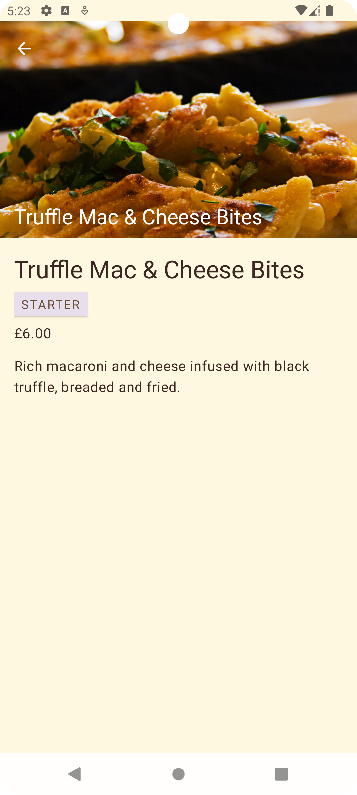

# MenuItem Android App

An Android application demonstrating a menu browsing feature with detailed views for menu items. Built with MVVM architecture, Retrofit networking, LiveData, and Kotlin Coroutines.

---

## Features

- Display a categorized list of menu items fetched from a REST API
- Detail screen for each menu item showing name, price, description, and image
- Network state handling with loading and error feedback
- Edge-to-edge UI support
- Clean and modular architecture

---

## Screenshots



---

## Architecture & Libraries

- **Language:** Kotlin
- **Architecture:** MVVM (Model-View-ViewModel)
- **Networking:** Retrofit with Gson converter
- **Asynchronous:** Kotlin Coroutines
- **LiveData:** For reactive UI updates
- **Testing:** JUnit, Mockito, Coroutine test libraries
- **Image Loading:** Glide
- **Logging:** OkHttp Logging Interceptor

---

## Getting Started

### Prerequisites

- Android Studio Arctic Fox or later
- Minimum SDK: 24
- Kotlin 1.5+

### Setup

1. Clone the repository:
   ```bash
   git clone https://github.com/amitne7/menu-assessment-task.git;
   ```